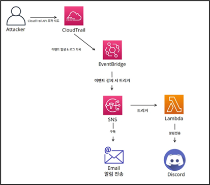

# 클라우드 환경의 침해사고 탐지 및 대응 환경 구축

> 입문자 및 비전공자를 위한 실습 중심 워크북 제작 프로젝트  
> 팀명: **AWS지 말라고 했지**
> 담당 멘토: 송수호
> 담당 PL: 우동규
> 팀원: 김기원(PM), 강유림, 권도원, 김진서, 박도은, 손형은, 장희영, 조민혁
> 프로젝트 진행기간: 2025.04.28 ~ 2025.08.10 

## 프로젝트 개요

### 배경 및 필요성
많은 기업이 온프레미스에서 클라우드 환경으로 전환하며 확장성과 효율성을 확보하고 있으나,  
구성 오류, 과도한 권한, 로그 미수집 등의 이유로 보안 사고 가능성도 함께 증가하고 있습니다.  
기존 교육 자료는 전문가 중심이라 입문자·비전공자의 진입 장벽이 높습니다.  
본 프로젝트는 이러한 교육 격차를 해소하고, 누구나 쉽게 이해할 수 있는 실습 기반 보안 교육 환경을 제공합니다.

### 목표
- **입문자도 이해 가능한 단계별 학습 콘텐츠 제공**
- **AWS 보안 기초부터 심화 대응까지 실습 기반 학습**
- **이론과 실습 병행으로 능동적인 보안 역량 강화**

---

## 프로젝트 구성

### AWS 서비스

AWS CloudTrail, GuardDuty, WAF, Config, SNS, Lambda, EventBridge, S3 등  
다양한 AWS 서비스로 탐지·대응 시나리오 구현

### IaC(Terraform)

Terraform 기반으로 인프라를 코드로 관리하여  
일관성·재현성·협업성을 확보하고, 보안 자동화를 효율적으로 적용

---

## 탐지 및 알림 시나리오 (총 8개)

1. **S3 퍼블릭 버킷 생성 탐지 및 알림**

2. **루트 계정 로그인 알림**

3. **AWS CloudTrail 비활성화 탐지**

4. **Security Group 정책 변경 탐지**

5. **새로운 IAM User 생성/삭제 탐지**

6. **로그 그룹 삭제/변경 탐지**

7. **스냅샷·자원 공유 통한 은폐/유출 시도 탐지**

8. **AMI 외부 공개/공유 시도 탐지**

> 각 시나리오는 EventBridge, SNS, Lambda, Discord Webhook을 활용하여 실시간 알림 및 자동 대응을 구현.

---

## 대응 시나리오 (총 5개)

1. **EC2 내 bash history 조작 시도 탐지 및 자동 대응**

2. **Athena 기반 CloudTrail 비정상 API 분석**

3. **GuardDuty Threat IP List 기반 모니터링**

4. **AWS WAF 정책 관리 및 모니터링**

5. **EC2 위험도 높은 악성행위 발생 시 네트워크 자동 격리**

---

## 심화 탐지 및 대응 시나리오 (총 2개)

1. **GuardDuty Malware Protection 악성 파일 탐지 및 Step Functions 자동 대응**

2. **AWS WAF 공격 과탐 모니터링 및 자동 차단**

---

## 프로젝트 성과
- **실습 워크북 제작**: GitBook 기반 오픈소스 공개 예정
- **클라우드 역량 검증**: 팀원 전원 AWS Cloud Practitioner 시험 응시, 5명 자격 취득
- **실무 적용성**: Terraform, Lambda, SSM, Step Functions, SIEM(Sumo Logic) 등 실무 기술 습득

---

## 향후 개선 방안
- 더 다양한 침해 시나리오 확장
- 실시간 알림 지연 문제 개선
- 외부 피드백 반영한 워크북 및 IaC 코드 지속 개선

---

## 참고 문헌
- [AWS 공식 문서](https://docs.aws.amazon.com/ko_kr/)
- [Terraform Tutorials](https://developer.hashicorp.com/terraform/tutorials)
- [Sumo Logic Docs](https://help.sumologic.com/)

---

> **문의**: 프로젝트 관련 문의는 레포지토리 이슈를 통해 남겨주세요.
